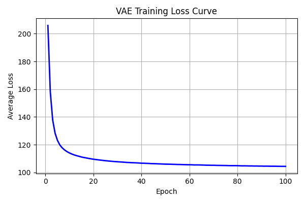
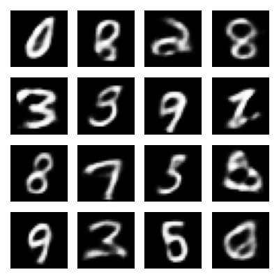
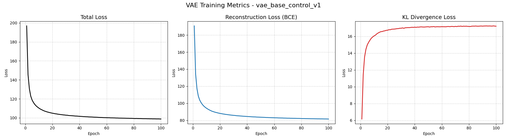
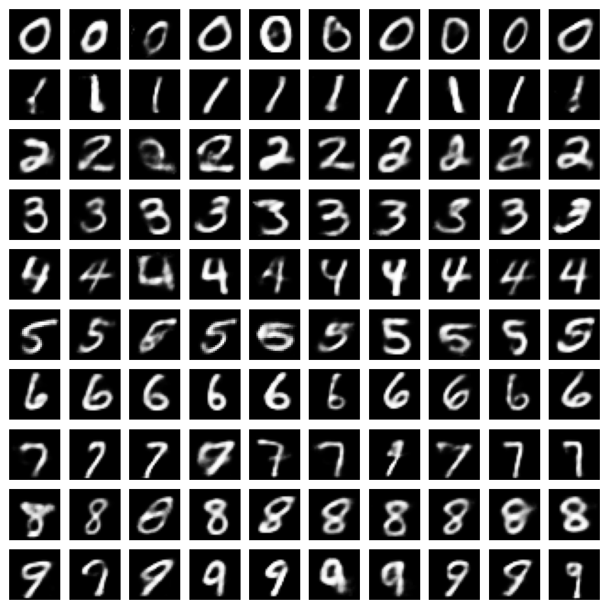
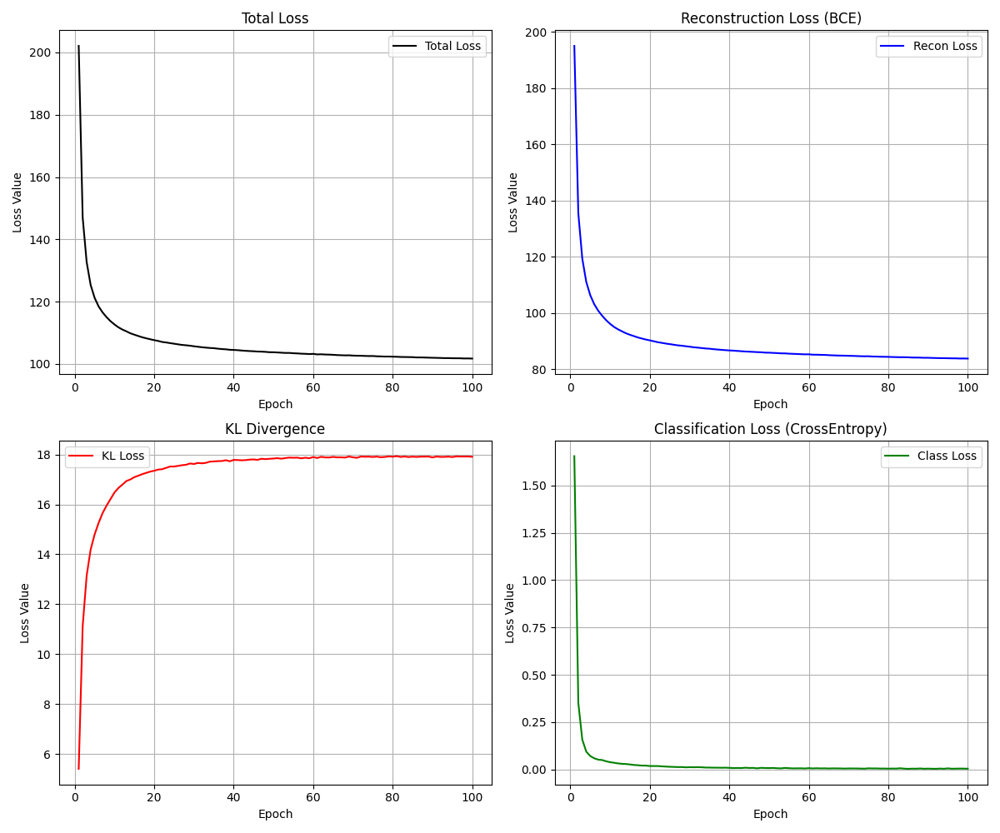
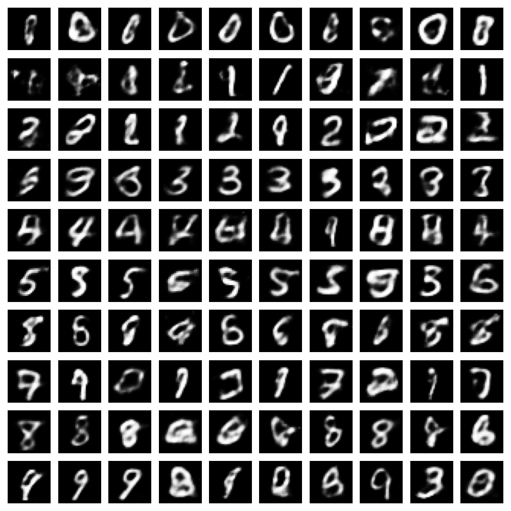
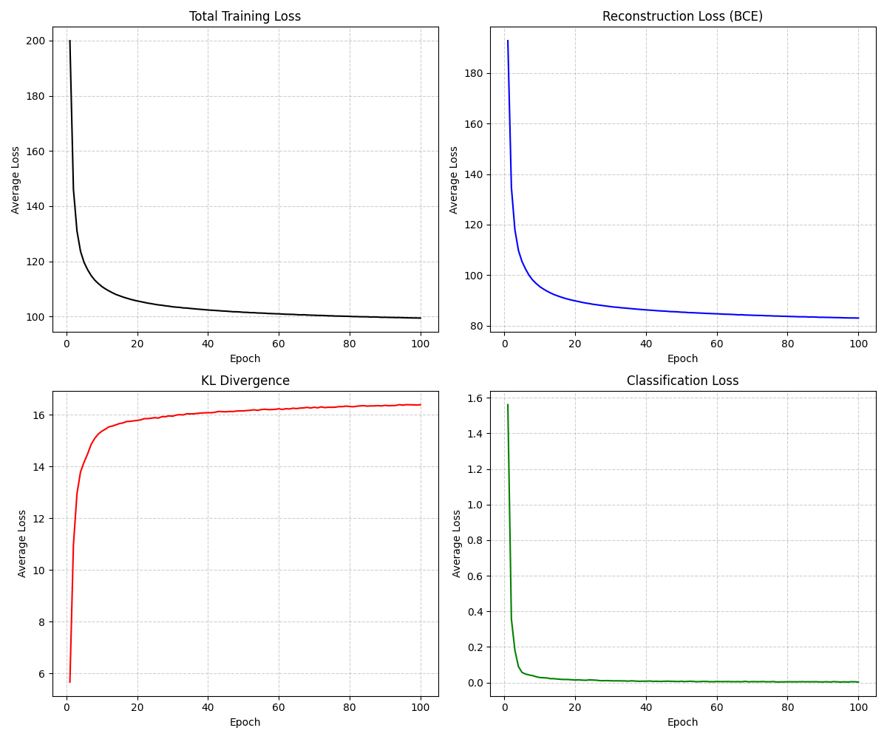
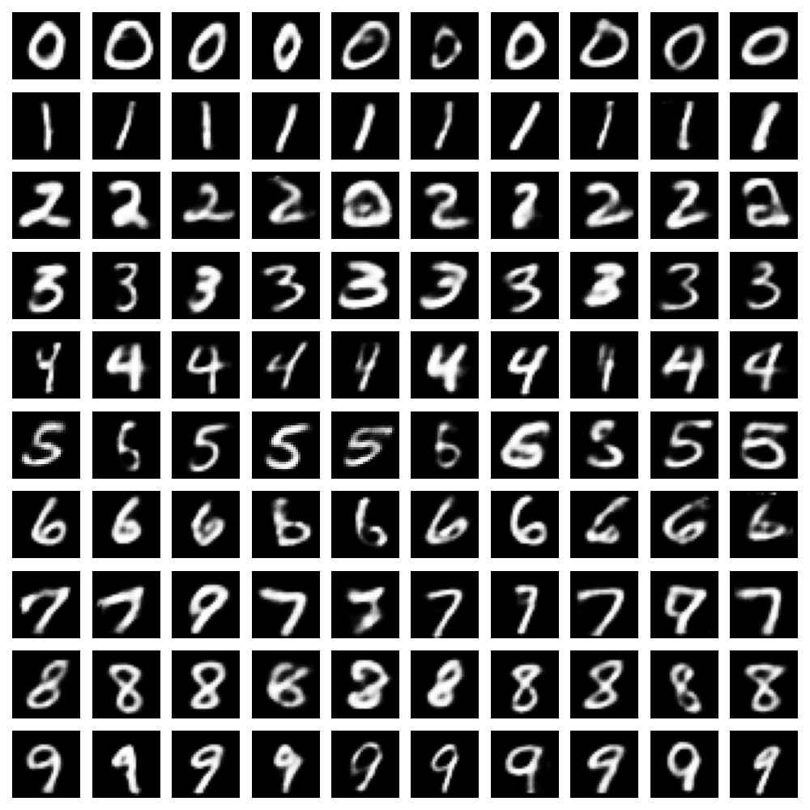
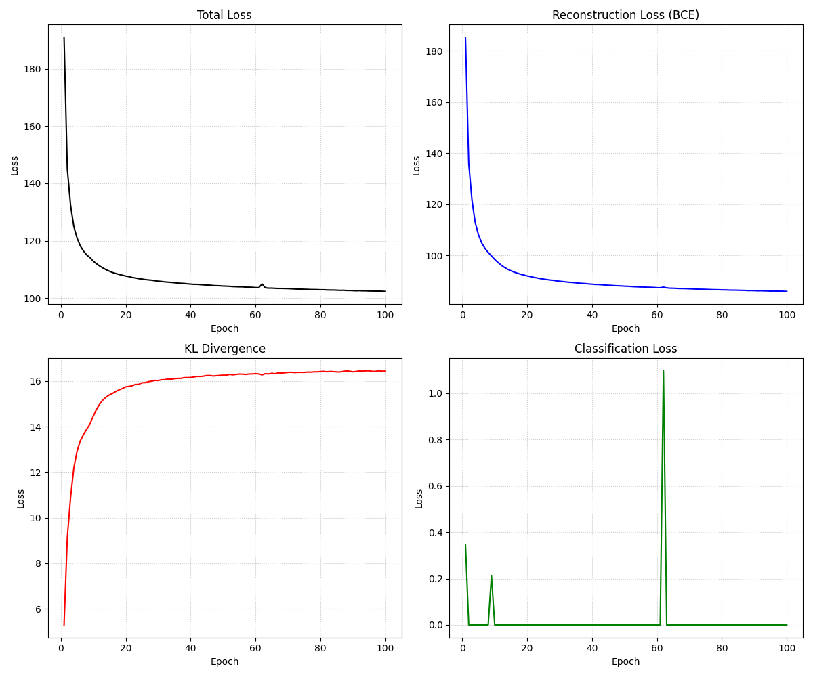
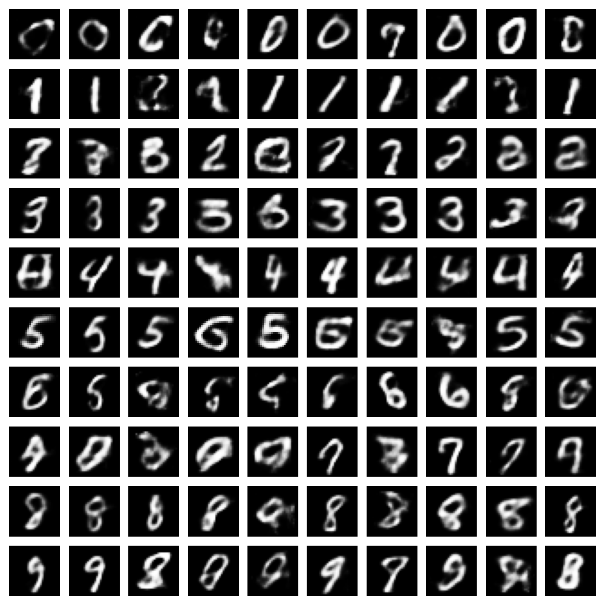

## VAE简介
变分自编码器（Variational Autoencoder, VAE）是一种生成模型，它通过引入潜在变量来学习数据的分布。VAE由编码器和解码器组成，编码器将输入数据映射到潜在空间中的一个分布，而解码器则从这个分布中采样并重构输入数据。

### VAE_BASE 实现

**模型结构**

**损失函数**
KL散度（Kullback-Leibler Divergence）用于衡量编码器输出的分布与先验分布之间的差异。
$$
\text{KL}(q(z|x) || p(z)) = -\frac{1}{2} \sum_{j=1}^{d} (1 + \log(\sigma_j^2) - \mu_j^2 - \sigma_j^2) \\
\text{KL}(q(z|x) || p(z)) \text{ 为凸函数，且在 } q(z|x) = p(z) \text{ 时取最小值 } 0
$$
其中，$q(z|x)$ 是编码器输出的分布，$p(z)$ 是先验分布（此处为标准正态分布），$\mu_j$ 和 $\sigma_j^2$ 分别是编码器输出的均值和方差。

重构损失（Reconstruction Loss）用于衡量输入数据与重构数据之间的差异。
$$
\text{Reconstruction Loss} = \|x - \hat{x}\|^2
$$
其中，$x$ 是输入数据，$\hat{x}$ 是解码器重构的数据。

**训练过程**

**生成样本**

**想法**
- 先验分布最好是一个稠密的分布，这样在潜在空间中采样时更容易得到合理的样本。
- KL 散度在 VAE 中的作用是使得编码器输出的分布接近$N(0, I)$，从而保证潜在空间的连续性。
- 不使用KL 散度，自行定义一个 loss 函数将编码器输出的分布约束在一个稠密的分布上，$-\frac{1}{2} \sum_{j=1}^{d} (1 + \log(\sigma_j^2) - \sqrt{\mu_j^2 + eps} - \mu_j^2 - \sigma_j^2)$

### VAE_BASE_Control 实现

**control v1**
- 在编码器中引入类别标签，将输入数据与类别标签进行拼接后输入到网络中。
- 在解码器中引入类别标签，将潜在变量与类别标签进行拼接后输入到网络中。

**control v2**
- 在解码器中引入类别标签，将潜在变量与类别标签进行拼接后输入到网络中。
- 引入了一个分类损失，用于约束解码器生成的样本能够正确地被分类器分类。

**control v3**
- 在编码器中引入类别标签，将输入数据与类别标签进行拼接后输入到网络中。
- 在解码器中引入类别标签，将潜在变量与类别标签进行拼接后输入到网络中。
- 引入了一个分类损失，用于约束解码器生成的样本能够正确地被分类器分类。

**control v4**
- 编码器用于提取样式信息，embedding用于表示类别信息，解码器将两者结合生成样本。
- 引入了一个分类损失，用于约束解码器生成的样本能够正确地被分类器分类。

**想法**
- 对比几种控制方法，发现在编码器中引入类别标签控制效果显著，为何 v2 和 v4 效果就没有 v1 和 v3 好呢？