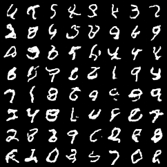
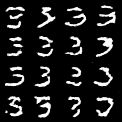

### 控制扩散

### Score 模型

生成效果：

#### 数学原理

**score 定义**
$$
s(x) = \nabla_x \log p(x)
$$

**噪声与 score 的关系**

tweedie公式：
$$
\text{当} x \sim \mathcal{N}(\mu, \sigma^2) \text{时，有以下式子成立：} \\
E[\mu | x] = x + \sigma^2 \nabla_x \log p(x)
$$

$$
\text{在扩散模型中，} x_t = \sqrt{\bar{\alpha}_t} x_0 + \sqrt{1 - \bar{\alpha}_t} \epsilon, \epsilon \sim \mathcal{N}(0, I) \\
x_{t} \sim \mathcal{N}(\sqrt{\bar{\alpha}_t} x_0, (1 - \bar{\alpha}_t) I) \\
\text{根据 tweedie 公式，我们可以得到：} \\
$$

$$
\begin{aligned}
E[\bar{\alpha}_t x_0 | x_t] &= x_t + (1 - \bar{\alpha}_t) \nabla_{x_t} \log p(x_t) \\
E[x_t - \sqrt{1 - \bar{\alpha}_t} \epsilon | x_t] &= x_t + (1 - \bar{\alpha}_t) \nabla_{x_t} \log p(x_t) \\
E[-\sqrt{1 - \bar{\alpha}_t} \epsilon | x_t] &= (1 - \bar{\alpha}_t) \nabla_{x_t} \log p(x_t) \\
E[\epsilon | x_t] &= -\sqrt{1 - \bar{\alpha}_t} \log p(x_t)
\end{aligned}
$$

期望值$E[\epsilon | x_t]$可以使用蒙特卡洛方法进行估计：
$$
\epsilon \approx -\sqrt{1 - \bar{\alpha}_t} \nabla_{x_t} \log p(x_t) = -\sqrt{1 - \bar{\alpha}_t} s(x_t)
$$

#### Score 加噪过程

标准的 score 模型预测的应该是 score，但在训练过程中，直接预测 score 会导致 loss 不稳定，因此我们仍然让模型预测噪声 $\epsilon$，然后在需要 score 时，通过 tweedie 公式将噪声转换为 score。

#### Score 去噪过程

在去噪过程中，我们需要使用 score 来更新样本。根据 Langevin 动力学的原理，更新公式如下：
$$
x_{t-1} = \frac{1}{\sqrt{\alpha_t}} \left( x_t - \frac{1 - \alpha_t}{\sqrt{1 - \bar{\alpha}_t}} \epsilon_\theta(x_t, t) \right) + \sqrt{\beta_t} z, \quad z \sim \mathcal{N}(0, I)
$$
其中，$\epsilon_\theta(x_t, t)$ 是模型预测的噪声

### Score 分类器引导版本

在分类器引导版本中，我们希望在生成过程中引入条件信息 $y$，使得生成的样本更符合条件 $y$。根据贝叶斯定理，我们可以将条件概率 $p(x_t | y)$ 表示为：
$$
p(x_t | y) = \frac{p(x_t) p(y | x_t)}{p(y)}
$$
然后计算关于 $x_t$ 的梯度：
$$
\nabla_{x_t} \log p(x_t | y) = \nabla_{x_t} \log p(x_t) + \nabla_{x_t} \log p(y | x_t)
$$
其中，$\nabla_{x_t} \log p(x_t)$ 可以通过 score 模型预测得到，而 $\nabla_{x_t} \log p(y | x_t)$ 可以通过一个分类器来预测得到。再向分类器指引中引入权重$\gamma$，最终的更新公式如下：
$$
s(x_t | y) = s_{\theta}(x_t) + \gamma \nabla_{x_t} \log p_{\phi}(y | x_t) \\
\epsilon_\theta(x_t, t) = -\sqrt{1 - \bar{\alpha}_t} s(x_t | y) \\
x_{t-1} = \frac{1}{\sqrt{\alpha_t}} \left( x_t - \frac{1 - \alpha_t}{\sqrt{1 - \bar{\alpha}_t}} \epsilon_\theta(x_t, t) \right) + \sqrt{\beta_t} z, \quad z \sim \mathcal{N}(0, I)
$$

训练效果：

### Score 无分类器引导版本

在无分类器引导版本中，我们直接在 score 模型中引入条件信息 $y$，使得模型能够直接预测条件 score $s(x_t | y)$。这样，在去噪过程中，我们就可以直接使用条件 score 来更新样本，无需额外的分类器。
$$
\begin{aligned}
\nabla_{x_t} \log p(x_t | y) &= \nabla_{x_t} \log p(x_t) + \gamma \nabla_{x_t} \log p(y | x_t) \\
&= \nabla_{x_t} \log p(x_t) + \gamma \nabla_{x_t} \log \frac{p(x_t|y)p(y)}{p(x_t)} \\
&= \nabla_{x_t} \log p(x_t) + \gamma \nabla_{x_t} \log p(x_t|y) - \gamma \nabla_{x_t} \log p(x_t) \\
&= s(x_t) + \gamma (s(x_t|y) - s(x_t))
\end{aligned}
$$
其中，无条件 score $s(x_t)$ 和条件 score $s(x_t|y)$ 都通过同一个模型来预测得到。当类别为空时，y 取一个特殊的值（如 -1），模型就会预测无条件 score；当类别不为空时，模型就会预测条件 score。最终的更新公式如下：
$$
s(x_t | y) = s_{\theta}(x_t) + \gamma (s_{\theta}(x_t|y) - s_{\theta}(x_t)) \\
\epsilon_\theta(x_t, t) = -\sqrt{1 - \bar{\alpha}_t} s(x_t | y) \\
x_{t-1} = \frac{1}{\sqrt{\alpha_t}} \left( x_t - \frac{1 - \alpha_t}{\sqrt{1 - \bar{\alpha}_t}} \epsilon_\theta(x_t, t) \right) + \sqrt{\beta_t} z, \quad z \sim \mathcal{N}(0, I)
$$

训练效果：

### score 总结
- 如果模型直接预测 score，那么在训练过程中，可能导致 loss 不稳定，因此我们让模型预测噪声，然后在需要使用 score 时(推理阶段)，通过 tweedie 公式将噪声转换为 score
- score 的优势在于它能够将条件梯度从噪声预测中分离出来，使得模型能够更灵活地引入条件信息，上面的分类器引导版本和无分类器引导版本就是两种不同的引入条件信息的方式
- 上面两个模型推理时都使用了同样的更新公式，只是 score 的计算方式不同，分类器引导版本通过一个额外的分类器来计算条件梯度，而无分类器引导版本则直接在 score 模型中引入条件信息来计算条件梯度
