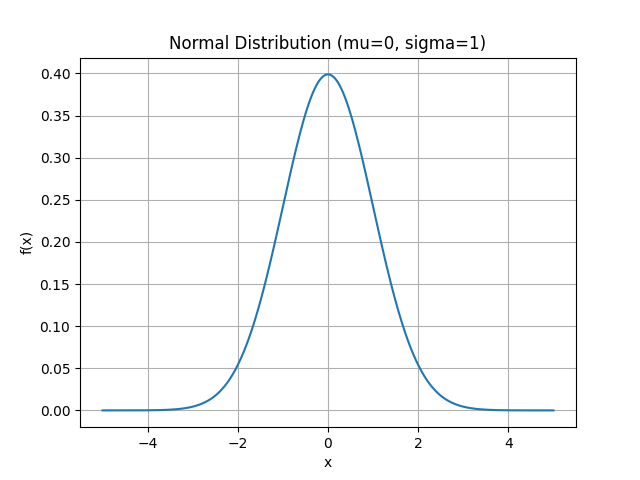
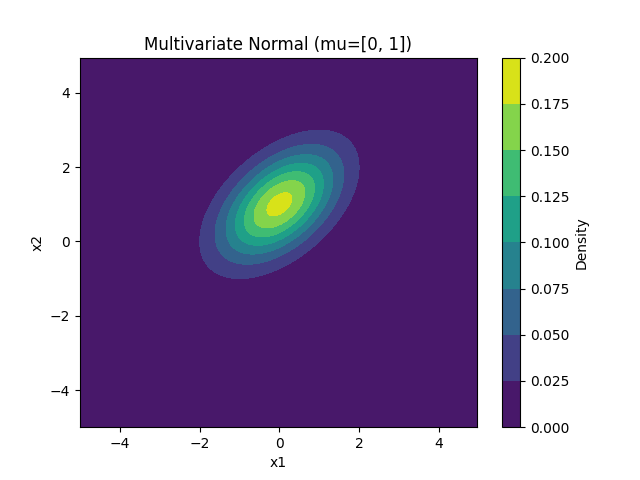

### 正态分布
正态分布（Normal Distribution），又称高斯分布，是一种连续概率分布，广泛应用于统计学、自然科学和社会科学等领域。正态分布的概率密度函数由以下公式定义：

**一维正态分布**

$$
f(x|\mu, \sigma^2) = \frac{1}{\sqrt{2\pi\sigma^2}} \exp\left(-\frac{(x-\mu)^2}{2\sigma^2}\right)
$$
其中，$\mu$ 是均值，$\sigma^2$ 是方差。

**多维正态分布**

$$
f(\mathbf{x}|\boldsymbol{\mu}, \boldsymbol{\Sigma}) = \frac{1}{(2\pi)^{k/2} |\boldsymbol{\Sigma}|^{1/2}} \exp\left(-\frac{1}{2} (\mathbf{x} - \boldsymbol{\mu})^T \boldsymbol{\Sigma}^{-1} (\mathbf{x} - \boldsymbol{\mu})\right)
$$
$$
\boldsymbol{\mu} =
\begin{bmatrix}
\mu_1 \\ \mu_2 \\ \vdots \\ \mu_k
\end{bmatrix},
\quad \boldsymbol{\Sigma} =
\begin{bmatrix}
\sigma_{11} & \sigma_{12} & \cdots & \sigma_{1k} \\ \sigma_{21} & \sigma_{22} & \cdots & \sigma_{2k} \\ \vdots & \vdots & \ddots & \vdots \\ \sigma_{k1} & \sigma_{k2} & \cdots & \sigma_{kk}
\end{bmatrix}
$$
其中，$\boldsymbol{\mu}$ 是均值向量，$\boldsymbol{\Sigma}$ 是协方差矩阵。

### 最大似然估计
最大似然估计（Maximum Likelihood Estimation, MLE）是一种参数估计方法，通过最大化似然函数来估计模型参数。对于正态分布，MLE 可以用来估计均值和方差。

**一维正态分布的最大似然估计**
设观测数据为 $x_1, x_2, \ldots, x_n$，则似然函数为：
$$
L(\mu, \sigma^2) = \prod_{i=1}^n \frac{1}{\sqrt{2\pi\sigma^2}} \exp\left(-\frac{(x_i-\mu)^2}{2\sigma^2}\right)
$$
似然函数取对数后得到对数似然函数：
$$
\ell(\mu, \sigma^2) = -\frac{n}{2} \log(2\pi\sigma^2) - \frac{1}{2\sigma^2} \sum_{i=1}^n (x_i - \mu)^2
$$
通过对 $\mu$ 和 $\sigma^2$ 求偏导并设为零，可以得到最大似然估计：
$$
\hat{\mu} = \frac{1}{n} \sum_{i=1}^n x_i \\
\hat{\sigma}^2 = \frac{1}{n} \sum_{i=1}^n (x_i - \hat{\mu})^2
$$

**多维正态分布的最大似然估计**
设观测数据为 $\mathbf{x}_1, \mathbf{x}_2, \ldots, \mathbf{x}_n$，则似然函数为：
$$
L(\boldsymbol{\mu}, \boldsymbol{\Sigma}) = \prod_{i=1}^n \frac{1}{(2\pi)^{k/2} |\boldsymbol{\Sigma}|^{1/2}} \exp\left(-\frac{1}{2} (\mathbf{x}_i - \boldsymbol{\mu})^T \boldsymbol{\Sigma}^{-1} (\mathbf{x}_i - \boldsymbol{\mu})\right)
$$
似然函数取对数后得到对数似然函数：
$$
\ell(\boldsymbol{\mu}, \boldsymbol{\Sigma}) = -\frac{nk}{2} \log(2\pi) - \frac{n}{2} \log|\boldsymbol{\Sigma}| - \frac{1}{2} \sum_{i=1}^n (\mathbf{x}_i - \boldsymbol{\mu})^T \boldsymbol{\Sigma}^{-1} (\mathbf{x}_i - \boldsymbol{\mu})
$$
通过对 $\boldsymbol{\mu}$ 和 $\boldsymbol{\Sigma}$ 求偏导并设为零，可以得到最大似然估计：
$$
\frac{\partial \ell(\boldsymbol{\mu}, \boldsymbol{\Sigma})}{\partial \mu} = 0 \\
\frac{\partial \ell(\boldsymbol{\mu}, \boldsymbol{\Sigma})}{\partial \boldsymbol{\mu}} = \boldsymbol{\Sigma}^{-1} \sum_{i=1}^n (\mathbf{x}_i - \boldsymbol{\mu}) = 0 \\
\hat{\boldsymbol{\mu}} = \frac{1}{n} \sum_{i=1}^n \mathbf{x}_i
$$

$$
\frac{\partial \ell(\boldsymbol{\mu}, \boldsymbol{\Sigma})}{\partial \Sigma} = 0 \\
\frac{\partial \ell(\boldsymbol{\mu}, \boldsymbol{\Sigma})}{\partial \boldsymbol{\Sigma}} = -\frac{n}{2} \boldsymbol{\Sigma}^{-1} + \frac{1}{2} \boldsymbol{\Sigma}^{-1} \sum_{i=1}^n (\mathbf{x}_i - \bold{\mu})(\mathbf{x}_i - \boldsymbol{\mu})^T \boldsymbol{\Sigma}^{-1} = 0 \\
\hat{\boldsymbol{\Sigma}} = \frac{1}{n} \sum_{i=1}^n (\mathbf{x}_i - \hat{\boldsymbol{\mu}})(\mathbf{x}_i - \hat{\boldsymbol{\mu}})^T
$$
