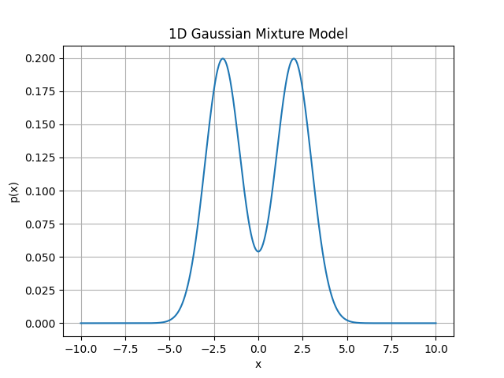
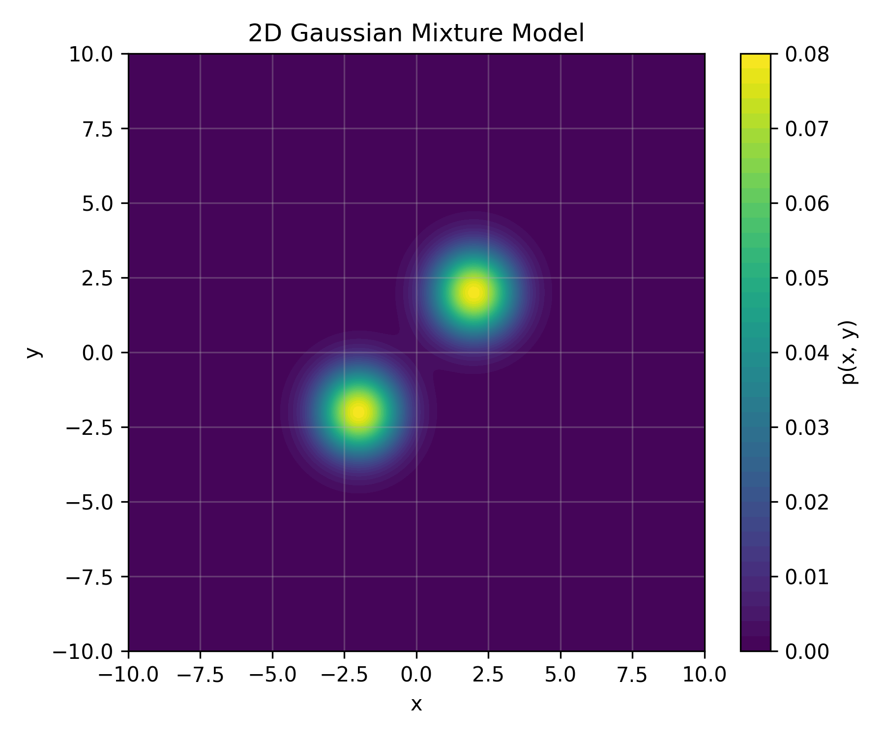

## 高斯混合模型
高斯混合模型（Gaussian Mixture Model, GMM）是一种概率模型，用于表示数据由多个高斯分布组成的混合分布。每个高斯分布称为一个组件，整个模型是这些组件的加权和。GMM常用于聚类、密度估计和生成模型等任务。

### GMM的定义
一个GMM可以表示为：
$$
p(x) = \sum_{k=1}^{K} \pi_k \mathcal{N}(x | \mu_k, \Sigma_k)
$$
其中，$K$ 是高斯分布的数量，$\pi_k$ 是第 $k$ 个高斯分布的权重，满足 $\sum_{k=1}^{K} \pi_k = 1$，$\mathcal{N}(x | \mu_k, \Sigma_k)$ 是第 $k$ 个高斯分布，参数为均值 $\mu_k$ 和协方差矩阵 $\Sigma_k$。

### GMM的参数估计

**最大似然估计**
给定一个数据集 $\{x_1, x_2, \ldots, x_N\}$，我们可以使用最大似然估计来估计GMM的参数。最大似然估计的目标是找到使得观测数据出现概率最大的参数值。对于GMM，似然函数可以表示为：
$$
L(\pi, \mu, \Sigma) = \prod_{n=1}^{N} p(x_n) = \prod_{n=1}^{N} \sum_{k=1}^{K} \pi_k \mathcal{N}(x_n | \mu_k, \Sigma_k)
$$
似然函数取对数后得到对数似然函数：
$$
\log L(\pi, \mu, \Sigma) = \sum_{n=1}^{N} \log \left( \sum_{k=1}^{K} \pi_k \mathcal{N}(x_n | \mu_k, \Sigma_k) \right)
$$
由于$\log{\sum}$的存在，直接对参数求导比较困难，因此通常使用期望最大化（EM）算法来迭代估计GMM的参数。