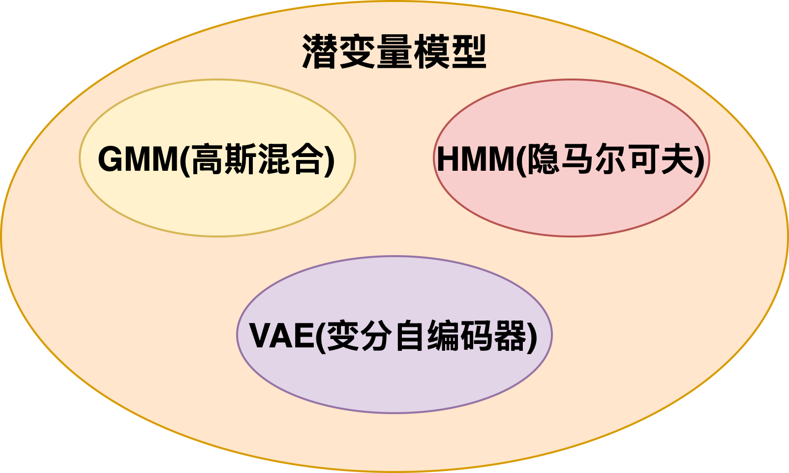

### KL 散度
KL 散度（Kullback-Leibler Divergence）是一种衡量两个概率分布之间差异的非对称度量。对于两个概率分布 \(P\) 和 \(Q\)，KL 散度定义为：
$$
D_{KL}(P \| Q) = \sum_{x} P(x) \log \frac{P(x)}{Q(x)}
$$
对于连续分布，KL 散度定义为：
$$
D_{KL}(P \| Q) = \int P(x) \log \frac{P(x)}{Q(x)} dx
$$
KL 散度的值总是非负的，且当且仅当 \(P = Q\) 时，KL 散度为零。

**KL 散度的性质**
1. **非对称性**：KL 散度不满足对称性，即 \(D_{KL}(P \| Q) \neq D_{KL}(Q \| P)\)。
2. **非负性**：KL 散度总是非负的，即 \(D_{KL}(P \| Q) \geq 0\)，且当 \(P = Q\) 时，\(D_{KL}(P \| Q) = 0\)。
3. **信息量**：KL 散度可以被解释为从分布 \(Q\) 到分布 \(P\) 的信息损失量，即使用分布 \(Q\) 来近似分布 \(P\) 时所损失的信息量。
4. **链式法则**：对于联合分布 \(P(X, Y)\) 和 \(Q(X, Y)\)，KL 散度满足链式法则：
$$
D_{KL}(P(X, Y) \| Q(X, Y)) = D_{KL}(P(X) \| Q(X)) + \mathbb{E}_{P(X)}[D_{KL}(P(Y|X) \| Q(Y|X))]
$$

**非负性的证明**
$$
\begin{aligned}
D_{\mathrm{KL}}(P|Q) &= \int P(x),\log\frac{P(x)}{Q(x)}dx \\
&= - \int P(x) \log\frac{Q(x)}{P(x)}dx \\
&= - \mathbb{E}_{x\sim P} \left[\log\frac{Q(x)}{P(x)}\right]
\end{aligned}
$$

由于对数函数 $\log(\cdot)$ 是凹函数，根据 **Jensen 不等式**：

$$
\mathbb{E}_{x\sim P}\left[\log\frac{Q(x)}{P(x)}\right]
\le
\log\left(\mathbb{E}_{x\sim P}\left[\frac{Q(x)}{P(x)}\right]\right)
$$

而
$$
\mathbb{E}_{x\sim P}\left[\frac{Q(x)}{P(x)}\right]
= \int P(x)\frac{Q(x)}{P(x)}dx
= \int Q(x)dx
= 1
$$

因此：
$$
\mathbb{E}_{x\sim P}\left[\log\frac{Q(x)}{P(x)}\right]
\le \log 1 = 0
$$

从而：
$$
D_{\mathrm{KL}}(P|Q)
= -\mathbb{E}_{x\sim P}\left[\log\frac{Q(x)}{P(x)}\right]
\ge 0
$$

且当且仅当$ P(x) = Q(x) $几乎处处相等时，取等号成立。

### KL 散度与最大似然估计之间的关系
设真实分布为 \(P\)，模型分布为 \(Q_\theta\)，其中 \(\theta\) 是模型的参数。分布的 KL 散度可以表示为：
$$
D_{KL}(P \| Q_\theta) = \sum_x P(x) \log \frac{P(x)}{Q_\theta(x)}
$$
由于 \(P\) 是未知的，可以使用蒙特卡洛方法来近似计算 KL 散度：
$$
\begin{aligned}
D_{KL}(P \| Q_\theta) &\approx \frac{1}{N} \sum_{i=1}^{N} \log \frac{P(x_i)}{Q_\theta(x_i)} \\
&= \frac{1}{N} \sum_{i=1}^{N} \log P(x_i) - \frac{1}{N} \sum_{i=1}^{N} \log Q_\theta(x_i)
\end{aligned}
$$
其中 \(x_i\) 是从真实分布 \(P\) 中采样的数据点。最大似然估计的目标是最大化模型分布 \(Q_\theta\) 对真实数据的似然，即最大化以下目标函数：
$$
\mathcal{L}(\theta) = \sum_{i=1}^{N} \log Q_\theta(x_i)
$$
可以看出，最大化似然函数等价于最小化 KL 散度：
$$
\argmin_\theta D_{KL}(P \| Q_\theta) \approx \argmax_\theta \mathcal{L}(\theta)
$$

### EM 算法推导

**潜变量模型**

**潜变量模型的对数似然**
设 潜变量为 \(Z\)，观测变量为 \(X\)，模型参数为 \(\theta\)，则潜变量模型的对数似然函数可以表示为：
$$
\log p_{\theta}(X) = \log \sum_Z p_{\theta}(X, Z)
$$
由于对数函数的存在，直接最大化对数似然函数 $\log p_{\theta}(X)$ 比较困难，因此引入概率的乘法定理来简化计算：
$$
\log p_{\theta}(X) = \log \frac{p_{\theta}(X, Z)}{p_{\theta}(Z|X)}
$$
由于直接计算 $p_{\theta}(Z|X)$ 比较困难，因此引入任意分布 $q(Z)$ ：
$$
\begin{aligned}
\log p_{\theta}(X) &= \log p_{\theta}(X) \sum_Z q(Z) \\
&= \sum_Z q(Z) \log p_{\theta}(X) \\
&= \sum_Z q(Z) \log \frac{p_{\theta}(X, Z)}{p_{\theta}(Z|X)} \\
&= \sum_Z q(Z) \log \frac{p_{\theta}(X, Z)}{q(Z)} + \sum_Z q(Z) \log \frac{q(Z)}{p_{\theta}(Z|X)} \\
&= \sum_Z q(Z) \log \frac{p_{\theta}(X, Z)}{q(Z)} + D_{KL}(q(Z) \| p_{\theta}(Z|X))
\end{aligned}
$$
由于 KL 散度 \(D_{KL}(q(Z) \| p_{\theta}(Z|X))\) 总是非负的，因此可以得到以下不等式：
$$
\log p_{\theta}(X) \geq \sum_Z q(Z) \log \frac{p_{\theta}(X, Z)}{q(Z)}
$$
这个不等式被称为 **ELBO（Evidence Lower Bound）**，它是对数似然函数的一个下界。EM 算法的**目标是最大化 ELBO**，从而间接最大化对数似然函数。
$$
ELBO(q, \theta) = \sum_Z q(Z) \log \frac{p_{\theta}(X, Z)}{q(Z)}
$$
ELBO 有两个参数：一个是分布 \(q(Z)\)，另一个是模型参数 \(\theta\)。EM 算法通过交替优化这两个参数来最大化 ELBO，从而最大化对数似然函数。
第一步：先固定模型参数 \(\theta\)，优化分布 \(q(Z)\)，观察下面的式子可以发现：
$$
\log p_{\theta}(X) = ELBO(q, \theta) + D_{KL}(q(Z) \| p_{\theta}(Z|X))
$$
等式左端不会随着 \(q(Z)\) 的变化而改变，因此当 \(q(Z) = p_{\theta}(Z|X)\) 时，KL 散度为零，此时 ELBO 达到最大值。因此，在 E 步中，我们将 \(q(Z)\) 更新为 \(p_{\theta}(Z|X)\)，从而最大化 ELBO。 $q(Z)$ 的更新公式为：
$$
q(Z) = p_{\theta}(Z|X)
$$
第二步：固定分布 \(q(Z)\)，优化模型参数 \(\theta\)，此时 ELBO 的更新公式为：
$$
\theta = \argmax_\theta ELBO(q, \theta) = \argmax_\theta \sum_Z q(Z) \log p_{\theta}(X, Z)
$$
EM 算法通过交替执行第一步(Expectation)和第二步(Maximization)来迭代优化模型参数 \(\theta\) 和分布 \(q(Z)\)，直到收敛为止。

### 多个数据下的 EM 算法

样本 $D=\{X^{(1)}, X^{(2)}, \ldots, X^{(N)}\}$ 的对数似然函数为：
$$
\log p_{\theta}(D) = \sum_{n=1}^{N} \log p_{\theta}(X^{(n)})
$$
对于每个样本 \(X^{(n)}\)，我们可以引入一个对应的概率分布 \(q(Z^{(n)})\)：
$$
\begin{aligned}
\log p_{\theta}(D) &= \sum_{n=1}^{N} \log p_{\theta}(X^{(n)}) \\
&= \sum_{n=1}^{N} \log p_{\theta}(X^{(n)}) \sum_{Z^{(n)}} q(Z^{(n)}) \\
&= \sum_{n=1}^{N} \sum_{Z^{(n)}} q(Z^{(n)}) \log p_{\theta}(X^{(n)}) \\
&= \sum_{n=1}^{N} \sum_{Z^{(n)}} q(Z^{(n)}) \log \frac{p_{\theta}(X^{(n)}, Z^{(n)})}{p_{\theta}(Z^{(n)}|X^{(n)})} \cdot \frac{q(Z^{(n)})}{q(Z^{(n)})} \\
&= \sum_{n=1}^{N} \sum_{Z^{(n)}} q(Z^{(n)}) \log \frac{p_{\theta}(X^{(n)}, Z^{(n)})}{q(Z^{(n)})} + \sum_{n=1}^{N} \sum_{Z^{(n)}} q(Z^{(n)}) \log \frac{q(Z^{(n)})}{p_{\theta}(Z^{(n)}|X^{(n)})} \\
&= \sum_{n=1}^{N} \sum_{Z^{(n)}} q(Z^{(n)}) \log \frac{p_{\theta}(X^{(n)}, Z^{(n)})}{q(Z^{(n)})} + \sum_{n=1}^{N} D_{KL}(q(Z^{(n)}) \| p_{\theta}(Z^{(n)}|X^{(n)}))
\end{aligned}
$$
因此，EM 算法的目标是最大化以下 ELBO：
$$
ELBO(q, \theta) = \sum_{n=1}^{N} \sum_{Z^{(n)}} q(Z^{(n)}) \log \frac{p_{\theta}(X^{(n)}, Z^{(n)})}{q(Z^{(n)})}
$$
EM 算法的更新步骤如下：
1. **E 步**：对于每个样本 \(X^{(n)}\)，更新对应的分布 \(q(Z^{(n)})\)：
$$
q(Z^{(n)}) = p_{\theta}(Z^{(n)}|X^{(n)})
$$
2. **M 步**：更新模型参数 \(\theta\)：
$$
\theta = \argmax_\theta ELBO(q, \theta) = \argmax_\theta \sum_{n=1}^{N} \sum_{Z^{(n)}} q(Z^{(n)}) \log p_{\theta}(X^{(n)}, Z^{(n)})
$$
EM 算法通过交替执行 E 步和 M 步来迭代优化模型参数 \(\theta\) 和分布 \(q(Z^{(n)})\)，直到收敛为止。

### \( \log p(x; \theta_{new}) \ge \log p(x; \theta_{old}) \) 的证明

E步完成后：
$$
D_{KL}(q_{new}(Z) \| p_{\theta_{old}}(Z|x)) = 0 \\
\log p(x; \theta_{old}) = ELBO(x;q_{new}, \theta_{old})
$$
M步完成后：
$$
ELBO(x;q_{new}, \theta_{new}) \ge ELBO(x;q_{new}, \theta_{old}) \\
\log p(x; \theta_{new}) = ELBO(x;q_{new}, \theta_{new}) + D_{KL}(q_{new}(Z) \| p_{\theta_{new}}(Z|x))
$$
由于 KL 散度总是非负的，因此：
$$
\log p(x; \theta_{new}) \ge ELBO(x;q_{new}, \theta_{new})
$$
因此：
$$
\log p(x; \theta_{new}) \ge \log p(x; \theta_{old})
$$

### GMM 的 EM 算法推导
设数据集为 \(X = \{x^{(1)}, x^{(2)}, \ldots, x^{(N)}\}\)，GMM 的参数为 \(\theta = \{\pi_k, \mu_k, \Sigma_k\}_{k=1}^{K}\)，其中 \(\pi_k\) 是第 \(k\) 个高斯分布的权重，\(\mu_k\) 是第 \(k\) 个高斯分布的均值，\(\Sigma_k\) 是第 \(k\) 个高斯分布的协方差矩阵。此时 GMM 的对数似然 \(D(X;\theta)\) 可以表示为：
$$
\begin{aligned}
\log D(X;\theta) &= \sum_{n=1}^{N} \log p_{\theta}(x^{(n)}) \\
&= \sum_{n=1}^{N} \log \left( \sum_{k=1}^{K} \pi_k \mathcal{N}(x^{(n)} ; \mu_k, \Sigma_k) \right)
\end{aligned}
$$
引入潜变量 $z$，$q^{(n)}(z=k)$表示第 $n$ 个数据点属于第 $k$ 个高斯分布的概率。GMM 的对数似然函数可以表示为：
$$
\begin{aligned}
\log D(X;\theta) &= \sum_{n=1}^{N} \log p_{\theta}(x^{(n)}) \\
&= \sum_{n=1}^{N} \log \frac{p_{\theta}(x^{(n)}, z)}{p_{\theta}(z|x^{(n)})} \\
&= \sum_{n=1}^{N} \sum_{k=1}^{K} q^{(n)}(z=k) \log \left( \frac{p_{\theta}(x^{(n)}, z=k)}{q^{(n)}(z=k)} \cdot \frac{q^{(n)}(z=k)}{p_{\theta}(z=k|x^{(n)})} \right) \\
&= \sum_{n=1}^{N} \sum_{k=1}^{K} q^{(n)}(z=k) \log \frac{p_{\theta}(x^{(n)}, z=k)}{q^{(n)}(z=k)} + \sum_{n=1}^{N} D_{KL}(q^{(n)}(z) \| p_{\theta}(z|x^{(n)})) \\
&= \sum_{n=1}^{N} \sum_{k=1}^{K} q^{(n)}(z=k) \log \frac{\pi_k \mathcal{N}(x^{(n)} ; \mu_k, \Sigma_k)}{q^{(n)}(z=k)} + \sum_{n=1}^{N} D_{KL}(q^{(n)}(z) \| p_{\theta}(z|x^{(n)}))
\end{aligned}
$$
因此，GMM 的 EM 算法的目标是最大化以下 ELBO：
$$
\begin{aligned}
ELBO(q, \theta) &= \sum_{n=1}^{N} \sum_{k=1}^{K} q^{(n)}(z=k) \log \frac{\pi_k \mathcal{N}(x^{(n)} ; \mu_k, \Sigma_k)}{q^{(n)}(z=k)} \\
&= \sum_{n=1}^{N} \sum_{k=1}^{K} q^{(n)}(z=k) \left( \log \pi_k + \log \mathcal{N}(x^{(n)} ; \mu_k, \Sigma_k) - \log q^{(n)}(z=k) \right)
\end{aligned}
$$
EM 算法的更新步骤如下：
1. **E 步**：对于每个数据点 \(x^{(n)}\)，更新对应的分布 \(q^{(n)}(z)\)：
$$
\begin{aligned}
q^{(n)}(z=k) &= p_{\theta}(z=k|x^{(n)}) \\
&= \frac{p_{\theta}(z=k,x^{(n)})}{p_{\theta}(x^{(n)})} \\
&= \frac{\pi_k \mathcal{N}(x^{(n)} ; \mu_k, \Sigma_k)}{\sum_{j=1}^{K} \pi_j \mathcal{N}(x^{(n)} ; \mu_j, \Sigma_j)}
\end{aligned}
$$

2. **M 步**：更新模型参数 \(\theta\)：
$$
\begin{aligned}
\pi_k &= \frac{1}{N} \sum_{n=1}^{N} q^{(n)}(z=k) \\
\mu_k &= \frac{\sum_{n=1}^{N} q^{(n)}(z=k) x^{(n)}}{\sum_{n=1}^{N} q^{(n)}(z=k)} \\
\Sigma_k &= \frac{\sum_{n=1}^{N} q^{(n)}(z=k) (x^{(n)} - \mu_k)(x^{(n)} - \mu_k)^T}{\sum_{n=1}^{N} q^{(n)}(z=k)}
\end{aligned}
$$
EM 算法通过交替执行 E 步和 M 步来迭代优化模型参数 \(\theta\) 和分布 \(q^{(n)}(z)\)，直到收敛为止。

**想法**
- GMM 的 EM 算法引入的潜变量 \(z\) 表示每个数据点属于哪个高斯分布。
- 对 M 步的更新公式推导尚未完成，后续会继续完善。