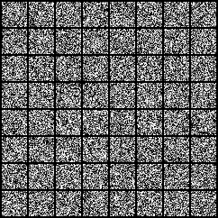
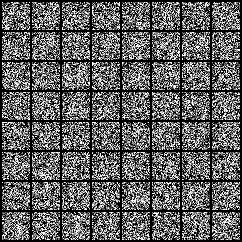
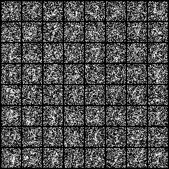
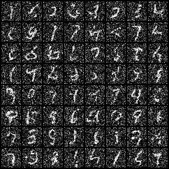
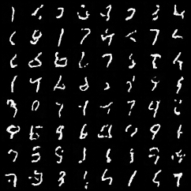

### 数学原理
pending...

### 训练效果

### 想法
- ddpm 模型的输出就是输入图像回溯time step的图像加噪到输入图像所用的噪声
- 在推理时，模型预测的是最终干净图像加噪到当前time step的噪声，然后将这个噪声当作上一个time step的图像加噪到当前time step的噪声，来还原得到上一个time step的图像；可以将模型输出看作是一个到最终干净图的梯度，不直接用来还原到干净图，而是在梯度方向上前进一小步，然后更新梯度，再前进一小步，直到还原到干净图像
